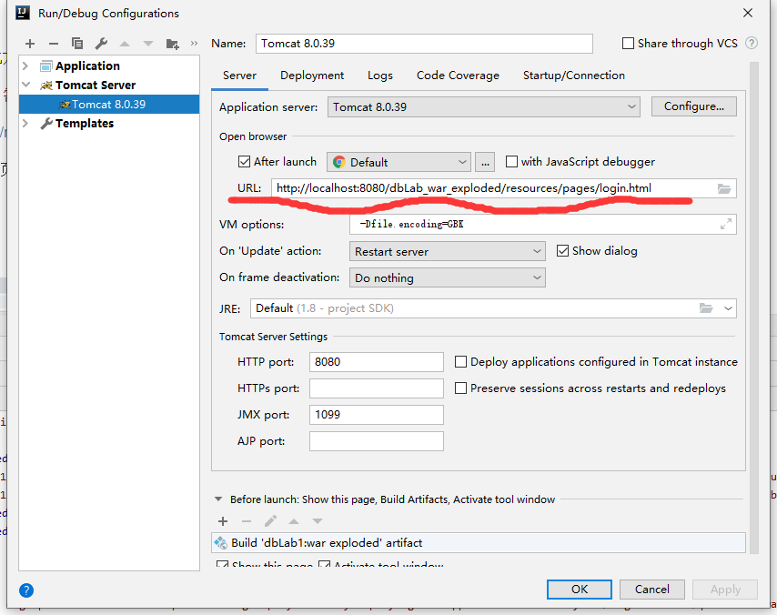
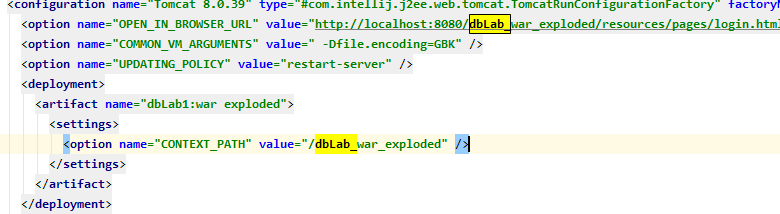
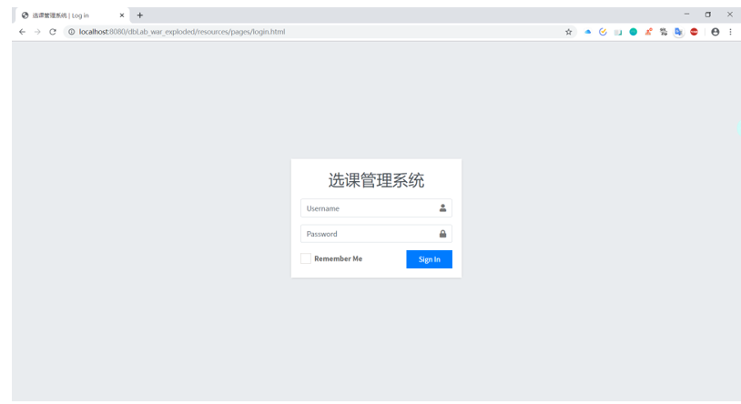
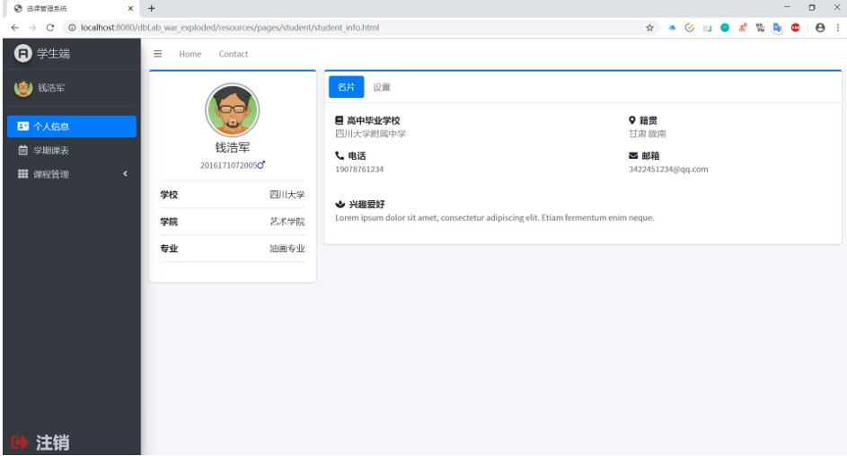
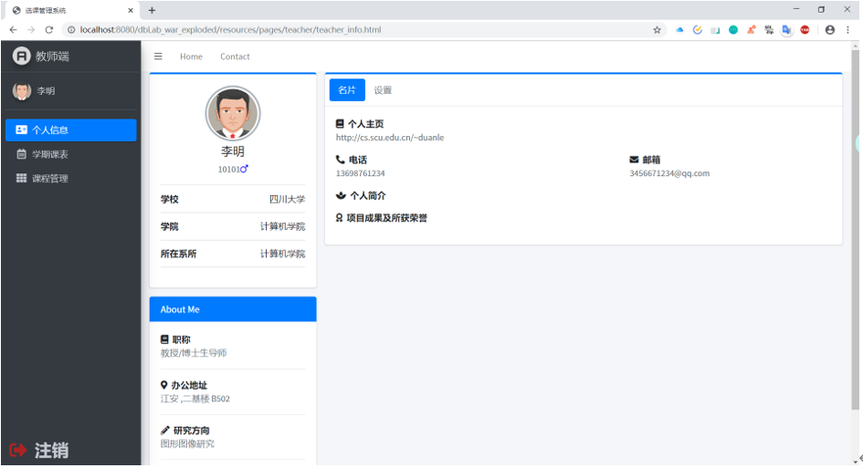

# 基于java web的学生选课老师开课系统

记录大三的数据库大作业的开发经验，我主要负责的是java后端开发，对servlet接口，前端的交互，数据库的对接有一定的掌握。

## 一、运行方式
### 
1. IDE我使用的是IDEA，这个编译器是真的方便，特别适合java项目的编写，它会自动帮你分析java包的依赖和引入关系，当然还有很多其他功能，具体需要多实践。那句话怎么来着

    > 实践是检验真理的唯一标准
                                                                                              
    从github.com上下载dbLab1后，使用IDEA打开dbLab1。
    
2. 这个是java web 项目，需要个服务器，这里使用本地的tomcat服务器，版本为8.0.39。[java web配置tomcat服务器方法](https://blog.csdn.net/u012149181/article/details/80698208)

3. 本项目需要mysql5.0数据库做后端数据存储，所以电脑上需要[安装mysql5.0](https://blog.csdn.net/Tang_Chuanlin/article/details/79603063)。

4. 安装好mysql5.0后，需要创建一个test数据库（这个数据库应该是自带的，可以用show databases 查看已有数据库），然后打开该项目下的sql文件，里面有两个sql脚本，需要依次执行。
    有两种执行方法。[一是直接在mysql命令行内执行](https://blog.csdn.net/vebasan/article/details/7619911)，[二是使用idea的atabase配置mysql数D据库执行](https://blog.csdn.net/chenshun123/article/details/51288814)。
    需要特别注意的是，mysql5.0默认的数据库存储、控制台显示编码是latin1编码，无法正常显示中文，而且可能会由于sql脚本编码与mysql5.0编码不匹配导致sql脚本运行出错（如1452错误等等），建议执行
    
     > show variables like 'character%';
     
     查看mysql的编码，  然后使用
     
     > alter database test character set utf8;                                                                                                                                                                                                                                                                                                                                                                                                      
                                                                                                                                                                                                                                                                                                                                                                                                             
     将character_set_database的编码改成utf8，然后使用
     
     > set character_set_results='gbk';
                                                                                                                                                                                                                                                                                                                                                                                                                                                                                                                                                                                                                                                                    
     将character_set_results的编码改成gbk。如此方可万无一失。
5. 最后，特别注意，IDEA运行java web的方式，需要在File下的project structure进行配置

    还需要设置tomcat的URL,这个URL是该项目运行后tomcat打开的初始网页。
    > http://localhost:8080/dbLab_war_exploded/resources/pages/login.html
    
    
    
    这里注意为什么是dbLab_war_exploded，因为在workspace.xml中设置了CONTEXT_PATH变量的值为dbLab_war_exploded。
    
    
                                                                               
   这里给出一个教师端的账号密码以便登录：
    > 账号：10101
                                                                                                                                                                                                                                                                                       
    > 密码：5555           
   
   
   
   
   
   
                                                                                                                                                                                                                                                                                                                                                                                                                                                                                                                                                                                             
###二、项目构架
####前端
* 前端使用的是网上的轮子，   是课程项目组负责前端的同学进行修改完善，并加入了jquery使得其能与java后端进行交互。

####后端
* 后端使用java的servlet接口和json进行数据传输，使用mysql进行数据存储，本人主要负责教师、学生端的后台处理，响应前端的操作等。
         
         
###三、项目报告
* [课程项目报告](./课程项目报告.docx)                                                                                                                                                                                                                                                                                                                                                                                                                                                                                                                                                                                                                                                                                                                                                                                                                                                                                                                                                                                                                                                                                                                                                                                                                                                                                                                                                                                                                                                                                                                                                                                                                                                                                                                                                                                                                                                                                                                                                                                                                                                                                                                                                                                                                                                       